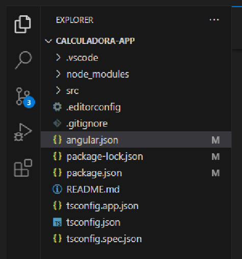
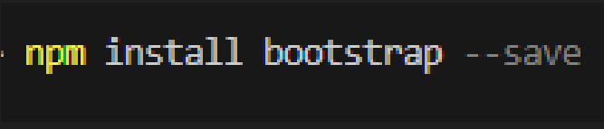
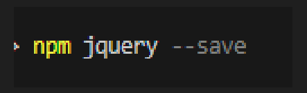
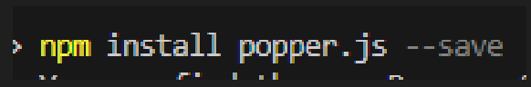
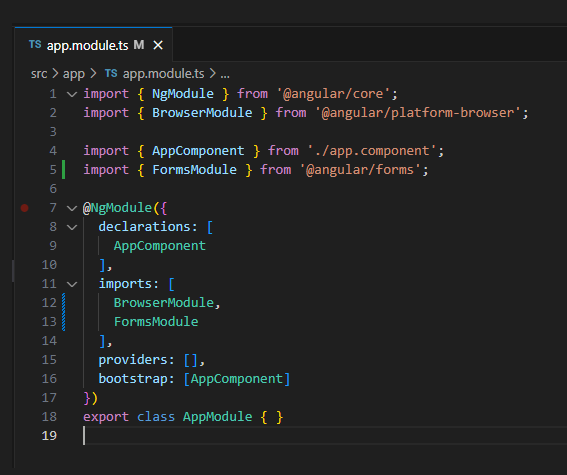
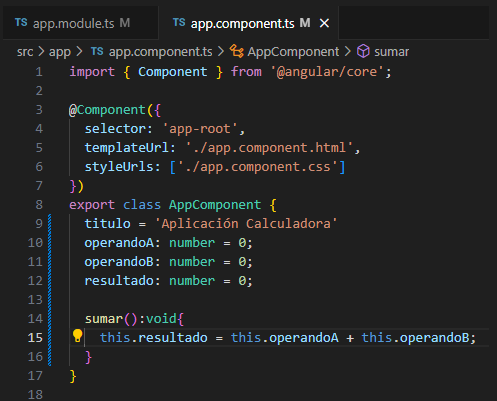
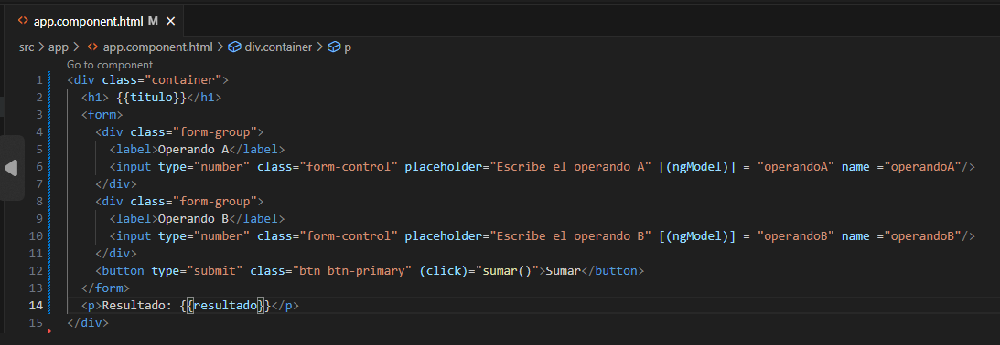
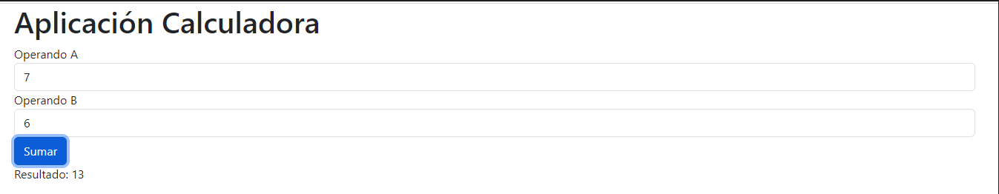

# Ejercicio Básico de Calculadora con Angular

¡Hola gente! :wave: 
Estoy poniéndome al día con **Angular** ya que lo tenia un poco oxidado. Este WorkSpace es un pequeño ejercicio de como he creado una calculadora simple. 

### ¡Espero que os guste! :smile:

***** 

## Primeros pasos

1.  Con el comando *ng new calculadora-app* creamos el proyecto.  En este caso vamos a utilizar los módulos que Angular nos proporciona.
 

2. Como vamos a usar Bootstrap vamos a instalarlo junto a un par de librerías que vamos a usar. 

3. A continuación, vamos al archivo *angular.json* a configurar los estilos. 

### Ahora que ya tenemos todo configurado correctamente ¡A por ello! :rocket:

* Agregamos un nuevo modulo, ya que vamos a utilizar el concepto **TWO-WAY BINDING** 

Agregamos *FormsModule* y automáticamente se importa.
 

* En el modulo *app.components.ts* definimos la clase y los métodos que necesitemos, en este caso solo vamos a utilizar la suma.
 

* Después, en el archivo *app.componet.html* modificamos el HTML utilizando Bootstrap como nosotros pensemos que es mejor para nuestro objetivo.  ![[Pasted image 20230921185827.png]]

* Arrancamos el proyecto con el comando **ng serve -o** y nos sale la siguiente imagen. 

